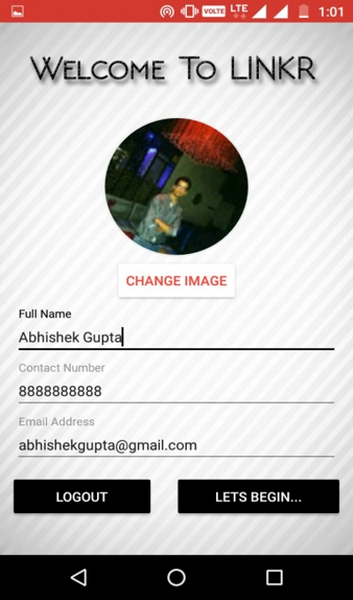
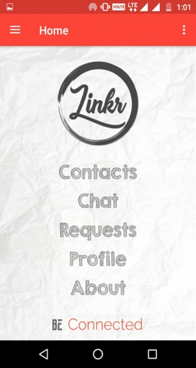
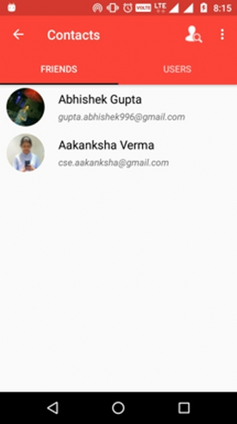
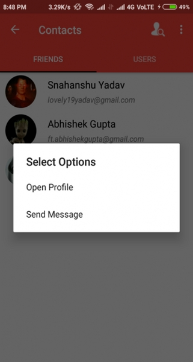
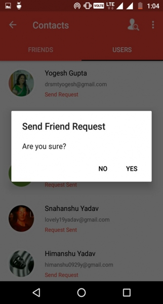
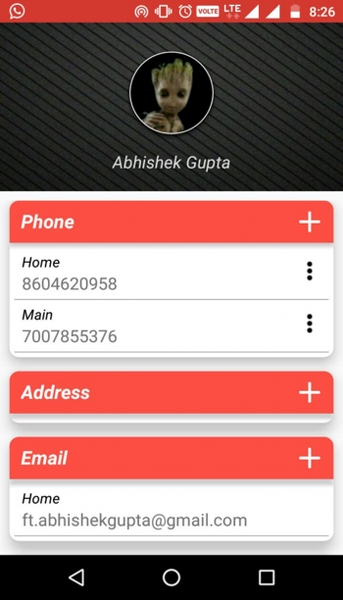
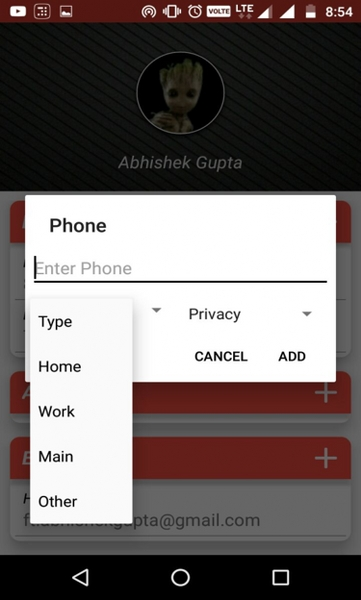

# Android Social Network - Linkr

## Introduction
Linkr is committed to help users "share life and stay touched" anytime, anywhere. You can use your mobile phone to view your friends’ dynamics, as well as keep them updated with your latest contact numbers and IM handles. With sign-in, chat, and links to all your social accounts enables you to access them through a single place. One might view it as a social version of LinkedIn as well.
## Objectives
1. User account creation, successful login and logout.
1. Create connections with other users of one’s choice.
1. Share profile with the connected users.
1. At the same time Hide your profile information from other users.
1. Any update in a profile are automatically reflected to all the connections corresponding to that profile and consistency is maintained.
1. Keep it easy to use and light weight


# Features :
* Google Authentication
* Control Your Profile and also its privacy
* Create connections with other users
* Chat Interface also available
* Used **Google Firebase** for server requirement

## To Run App
1. Download ```APP-APK.apk``` [Download Link](https://raw.githubusercontent.com/ft-abhishekgupta/android-socialnetwork-linkr/master/APP-APK.apk "Direct Download")
1. Install on Android Device and run.

## To use source code : 
1. Clone Repository <br>
```git clone https://github.com/ft-abhishekgupta/android-socialnetwork-linkr```
1. Open Repository in Android Studio
1. Sync Project and Install Required Dependencies
1. Create project in Firebase, Upload SHA1 Fingerprint, Connect Project.
1. Build and Run Project.

## Screenshots







